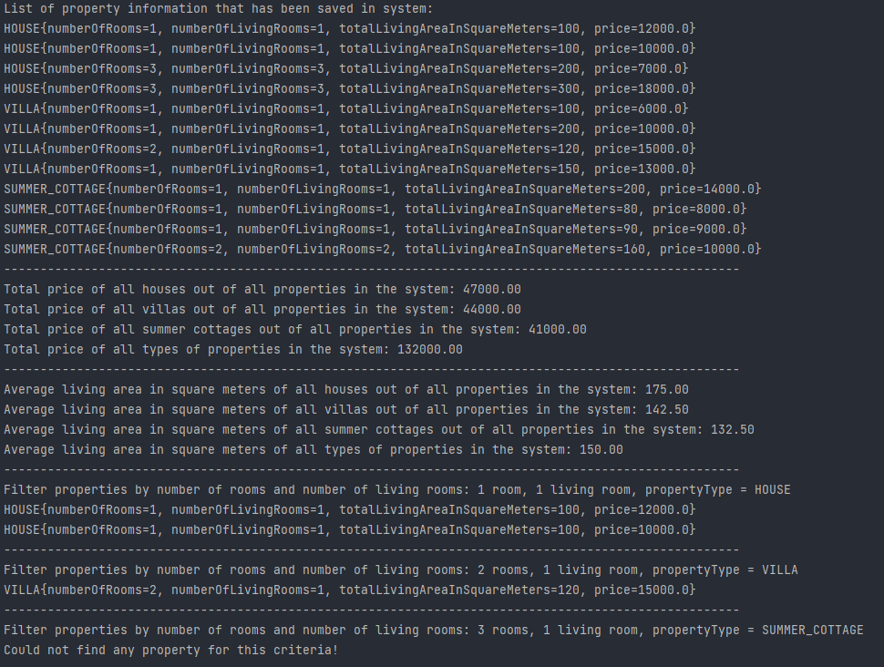

# Real Estate Property Management System

## Overview

This project is a Real Estate Property Management System that allows users to manage various types of properties such as houses, villas, and summer cottages. It includes classes for different property types, a service interface, an implementation of the service, and a class to load mock property data.

## Table of Contents

- [Classes](#classes)
- [Interfaces](#interfaces)
- [Usage](#usage)
- [Mock Data](#mock-data)

## Classes

### Property

The `Property` class is an abstract class representing a generic real estate property. It contains properties like the number of rooms, living rooms, total living area in square meters, and the price. Subclasses include `House`, `Villa`, and `SummerCottage`.

### House, Villa, SummerCottage

These are concrete implementations of the `Property` class, representing different types of real estate properties.

### PropertyService

The `PropertyService` interface defines methods for managing properties, such as calculating total prices, average square meters, and filtering properties based on criteria.

### PropertyServiceImpl

`PropertyServiceImpl` is the implementation of the `PropertyService` interface. It provides functionality to calculate total prices, average square meters, and filter properties based on specified criteria.

### LoadMockPropertyData

The `LoadMockPropertyData` class is responsible for loading mock property data into a list of `Property` objects. This data is then used for testing and demonstration purposes.

## Interfaces

### PropertyService

The `PropertyService` interface defines the contract for managing properties, including methods to calculate total prices, average square meters, and filter properties.

## Usage

To use the Real Estate Property Management System:

1. Instantiate a `PropertyServiceImpl` object with a list of properties.
2. Utilize the methods provided by the `PropertyService` interface to perform various operations on the properties.

```java
List<Property> propertyList = LoadMockPropertyData.getPropertyList();
PropertyService propertyService = new PropertyServiceImpl(propertyList);

// Example usage of methods
double totalPricesofHouses = propertyService.getTotalPriceOfPropertiesByType(PropertyType.HOUSE);
double totalPricesofVillas = propertyService.getTotalPriceOfPropertiesByType(PropertyType.VILLA);
double totalPricesofSummerCottages = propertyService.getTotalPriceOfPropertiesByType(PropertyType.SUMMER_COTTAGES);
double totalPrice = propertyService.getTotalPriceOfAllProperties();


double averageSquareMetersOfHouses = propertyService.getAverageSquareMetersOfPropertiesByType(PropertyType.HOUSE);
double averageSquareMetersOfVillas = propertyService.getAverageSquareMetersOfPropertiesByType(PropertyType.VILLA);
double averageSquareMetersOfCottages = propertyService.getAverageSquareMetersOfPropertiesByType(PropertyType.SUMMER_COTTAGE);
double averageSquareMeters = propertyService.getAverageSquareMetersOfAllProperties();


List<Property> filteredHouses = propertyService.filterPropertiesByRoomAndLivingRoom(2, 2, PropertyType.HOUSE);
List<Property> filteredVillas = propertyService.filterPropertiesByRoomAndLivingRoom(1, 1, PropertyType.VILLA);
List<Property> filteredCottages = propertyService.filterPropertiesByRoomAndLivingRoom(3, 1, PropertyType.SUMMER_COTTAGE);
```

## Screenshot of Project Output


## License

Distributed under the MIT License. See `LICENSE.txt` for more information.

<!-- CONTACT -->

## Contact

### Mehmet Akif Tanisik

<a href="https://github.com/mehmet-akif-tanisik" target="_blank">

</a>
<a href = "mailto:matnsk@outlook.com?subject = Feedback&body = Message">

</a>
<a href="https://linkedin.com/in/mehmet-akif-tanisik" target="_blank">

</a>  
<a href="https://twitter.com/makiftanisik" target="_blank">

</a>

<!-- PROJECT-BOOTCAMP-PRACTICUM PART -->

<br />

## Talenthub Bootcamp - N11 & Patika


