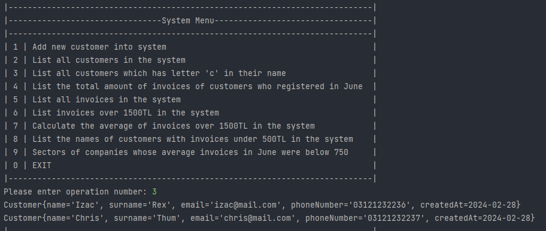
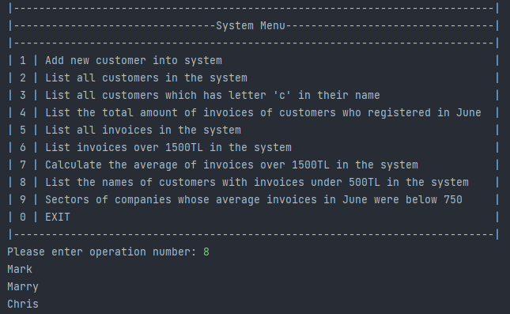

# Customer Management System

This project implements a basic customer management system with functionalities for adding, listing, and filtering customers, as well as managing invoices and performing calculations on them.

## Features:

### Customer Management:
- Add new customers to the system.
- List all existing customers.
- Filter customers by name containing the letter "C".

### Invoice Management:
- Calculate the total invoice amount of customers registered in June.
- List all invoices in the system.
- Filter invoices by total amount exceeding 1500TL.
- Calculate the average of invoices exceeding 1500TL.
- List names of customers with invoices below 500TL.
- Identify sectors of companies whose average June invoices were below 750TL.

## Usage:

1. Clone or download the project repository.
2. Open the project in your preferred IDE.
3. Run the AppRunner class to start the application and interact with the menu.

## Screenshot of Project Output

## License

Distributed under the MIT License. See `LICENSE.txt` for more information.

<!-- CONTACT -->

## Contact

### Mehmet Akif Tanisik

  

<!-- PROJECT-BOOTCAMP-PRACTICUM PART -->

 

## Talenthub Bootcamp - N11 & Patika

  

<h3 align="center">Company: N11.com</h3>

  
<h3 align="center">Organizer: Patika.dev</h3>   

